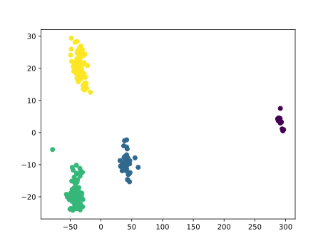

# Fruit Identification using Arduino and SVM

In this post I'm going to replicate the tutorial found on the [Tensorflow blog](https://blog.tensorflow.org/2019/11/fruit-identification-using-arduino-and-tensorflow.html)
where an Arduino BLE 33 Nano Sense
is used to classify RGB components into colors. Here, however, I'm not using
an Arm Cortex M4 chip: I'll use an Attiny 85 :fire::fire::fire:!

Since the features are going to be of dimension 3 only (RGB components), my
model is going to be very small (it has 9 support vectors): on my IDE v1.8.9 the compiled code
occupies 1116 bytes (54%) of program space and 13 bytes (10%) of memory.
Yes, you read it right: **13 bytes**. 

Let's take a moment to fully appreciate this figures; quoting the official website of Tensorflow Lite for
microcontrollers: `The core runtime fits in 16 KB on an Arm Cortex M3`, 
and that's without any operator. When I run the provided code on the exact
same samples, it produced a model of **2152 bytes**: you will never fit 
that much code into a microcontroller so tiny (not talking about how much
it took to train the network...).

Back to the project, the steps are the same as to all machine learning projects:

 1. record sample data: put some colored objects in front of your sensor
    and record the readings (use a microcontroller with Serial in this stage).
    Don't forget to sample the "no color" too: don't put anything in front
    of the sensor and let it record for a while.
 2. train an SVM classifier on your laptop with Python's scikit-learn
 3. run `svm-porter` on the trained classifier
 4. copy and include the `ml.h` file in your Arduino project

If you sampled colors far apart from each other you should end with a 
well separated model, like in the image below (2 pca components plotted).



Now running the inference is just a matter of packing the RGB components in
a single array and call `predict`:

```cpp
/*********
  @taken_from
  Rui Santos
  Complete project details at http://randomnerdtutorials.com
  The sensor used in a TCS230 or TCS3200
*********/

// change to `print(x) Serial.print(x)` during sample recording
#define print(x) 

#include "ml.h"

#define S2 1
#define S3 2
#define sensorOut 3


int readComponent(bool s2, bool s3) {
  digitalWrite(S2, s2);
  digitalWrite(S3, s3);
  
  int component = pulseIn(sensorOut, LOW);
  
  print(component);
  print('\t');
  delay(10);

  return component;
}


void setup() {
  pinMode(S2, OUTPUT);
  pinMode(S3, OUTPUT);
  pinMode(sensorOut, INPUT);
  
  //Serial.begin(115200);
}


void loop() {
  int red   = readComponent(LOW, LOW);
  int green = readComponent(HIGH, HIGH);
  int blue  = readComponent(LOW, HIGH);

  double features[3] = { red, green, blue };
  uint8_t classIdx = predict(features);
  const char *className = classIdxToName(classIdx);
  
  print('\n');
  print(className);
  print('\n');
  delay(500);
}
```

That's it: you deployed machine learning to an Attiny 85 :+1:. Given the 
simplicity of the task, you should easily achieve near 100% accuracy for
different colors (I had some troubles distinguishing orange from yellow
because of the bad illumination). 
Just be sure to replicate the exact same setup both during training and classification.

I'll paste my generated ml.h file too

```cpp

#pragma once

double apply_kernel(double *x, double *w) {
  double kernel = 0;

  for (uint8_t i = 0; i < 3; i++)
    kernel += x[i] * w[i];

  return kernel;
}

int predict(double *x) {
    double w[3];
    double kernels[9] = { 0 };
    double decisions[6] = { 0 };
    int votes[4] = { 0 };

    w[0] = 30.0; w[1] = 53.0; w[2] = 25.0;
    kernels[0] = apply_kernel(x, w);
    w[0] = 170.0; w[1] = 258.0; w[2] = 93.0;
    kernels[1] = apply_kernel(x, w);
    w[0] = 157.0; w[1] = 233.0; w[2] = 84.0;
    kernels[2] = apply_kernel(x, w);
    w[0] = 205.0; w[1] = 312.0; w[2] = 105.0;
    kernels[3] = apply_kernel(x, w);
    w[0] = 211.0; w[1] = 303.0; w[2] = 105.0;
    kernels[4] = apply_kernel(x, w);
    w[0] = 211.0; w[1] = 304.0; w[2] = 100.0;
    kernels[5] = apply_kernel(x, w);
    w[0] = 180.0; w[1] = 318.0; w[2] = 104.0;
    kernels[6] = apply_kernel(x, w);
    w[0] = 183.0; w[1] = 328.0; w[2] = 106.0;
    kernels[7] = apply_kernel(x, w);
    w[0] = 176.0; w[1] = 310.0; w[2] = 102.0;
    kernels[8] = apply_kernel(x, w);

    // vote
    decisions[0] = 1.5700826
         + kernels[0] * 3.84e-05
         + kernels[2] * -3.84e-05;
    decisions[1] = 1.4065215
         + kernels[0] * 1.97e-05
         + kernels[5] * -1.97e-05;
    decisions[2] = 1.4271657
         + kernels[0] * 2.14e-05
         + kernels[8] * -2.14e-05;
    decisions[3] = 11.1926244
         + kernels[1] * 0.0005206
         + kernels[4] * -0.0002205 + kernels[5] * -0.0003001;
    decisions[4] = 11.8280751
         + kernels[1] * 0.0007089
         + kernels[8] * -0.0007089;
    decisions[5] = -7.4206153
         + kernels[3] * 0.003034
         + kernels[6] * -0.002586 + kernels[7] * -0.000448;

    votes[decisions[0] > 0 ? 0 : 1] += 1;
    votes[decisions[1] > 0 ? 0 : 2] += 1;
    votes[decisions[2] > 0 ? 0 : 3] += 1;
    votes[decisions[3] > 0 ? 1 : 2] += 1;
    votes[decisions[4] > 0 ? 1 : 3] += 1;
    votes[decisions[5] > 0 ? 2 : 3] += 1;

    int classVal = -1;
    int classIdx = -1;

    for (int i = 0; i < 4; i++) {
        if (votes[i] > classVal) {
            classVal = votes[i];
            classIdx = i;
        }
    }

    return classIdx;
}

const char* classIdxToName(uint8_t classIdx) {
    switch (classIdx) {

        case 0:
            return "none";
        case 1:
            return "lemon";
        case 2:
            return "grape";
        case 3:
            return "tomato";
        default:
            return "UNKNOWN";
    }
}
```